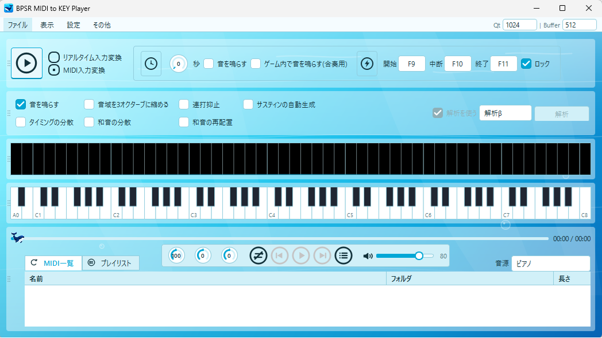

# BPSR MIDI to KEY Player

[English](README.en.md) | [中文](README.zh-CN.md)

> **多言語対応:** 日本語 / English / 中文 のUI表示に対応しています。

> [!IMPORTANT]
> **StarLauncher版スタレゾを使用する場合**
>
> StarLauncher版スタレゾは管理者権限で動作するため、本アプリも管理者権限で起動する必要があります。本アプリが通常権限のままでは、Windowsの権限制約によりキー情報をゲームクライアントへ送信できません。
>
> メニューバーの `設定 > 管理者権限で起動` にチェックを入れ、アプリを終了してから再度起動してください。設定は次回起動時から反映されます。Steam版スタレゾでは管理者権限は不要です。

> **マルチプロセスによる負荷分散:** GUI、ソフトウェア音源、MIDI解析を3つのプロセスへ分離し、重いMIDI解析や波形生成が画面操作を直接占有しにくい構成にしています。

BPSR MIDI to KEY Player は、MIDIファイルやUSB MIDIキーボード入力を、Windows上のキーボード入力へ変換するデスクトップツールです。

BPSR系のキーボード演奏を想定しており、MIDIノートを通常のキーボードキーに割り当て、現在フォーカスされているアプリへ入力します。MIDI音源再生、トラック／チャンネル選択、リアルタイム入力変換、音域調整、キーバインド変更、グローバルショートカット、テーマ変更、タスクトレイ格納にも対応しています。

## 画面



## 配布形式

本ソフトは、インストール不要のフォルダ展開版として配布します。配布ZIPを任意の場所へすべて展開し、`BPSR_MIDI_to_KEY_Player` フォルダ内の `BPSR_MIDI_to_KEY_Player.exe` を起動してください。

`_internal` フォルダには動作に必要なファイルが含まれています。EXEだけを別の場所へ移動したり、フォルダ内のファイルを削除したりしないでください。

## 主な機能

- 選択フォルダと配下の全サブフォルダから`.mid` / `.midi`ファイルを再帰的に読み込み。
- MIDI一覧に曲名、フォルダ階層、長さを表示。フォルダ階層は`親 > 子 > 孫`形式で表示。
- 選択中MIDIの最終出力音域を鍵盤と音ゲー欄へ反映。鍵盤の未使用範囲は、不透明な黒地の斜線で表示。
- MIDI一覧の各列はヘッダー境界のドラッグで幅を変更でき、変更後の幅を設定へ保存。
- MIDI一覧のダブルクリックでMIDI音源を再生／停止。
- MIDIファイルをキーボード入力として再生。
- USB MIDIキーボード入力をリアルタイムにキーボード入力へ変換。
- USB MIDI機器の接続・切断を検知し、切断時はリアルタイム入力変換を安全に停止。再接続時はデバイス一覧を更新し、入力受付は自動再開しません。
- `音を鳴らす`を有効にすると、キー入力を送信しながら変換結果の音も再生。
- 音量バー、ミュート、再生位置、再生速度(10-200%)を調整。速度ノブのダブルクリックで100%に復帰。
- 表示メニューからウィンドウの拡大率(100-200%)と透明度を調整。
- トランスポーズ(-12から+12半音)とオクターブシフト(-3から+3)をプレイヤー上部から調整。各ノブのダブルクリックで0に復帰。
- 鍵盤下の左右マーカーで、音域を縮める範囲をA0-C8から指定。最小幅は12音です。
- `音域を指定幅に縮める`を有効にすると、範囲外の音をオクターブ単位で指定範囲へ移動。
- MIDI一覧の曲名を右クリックして、詳細設定、速度、トランスポーズ、オクターブシフト、指定音域、トラック／チャンネル状態を曲ごとに保存・削除。保存済みの曲は一覧の`○`で確認できます。
- タイミングの分散、和音の分散、和音の再配置、サスティンの自動生成を設定。
- 連打抑止を設定。
- 使用されているトラック／チャンネルを `11` 形式の丸型ボタンで表示。
- トラック／チャンネルの組み合わせごとのオン・オフ。再生中も即時反映。
- サステインペダル CC64 を Space キーへ変換。
- ピアノ、エレクトリックピアノ、オルガン、シンセからソフトウェア音源を選択。
- GUI、ソフトウェア音源／PCM出力、MIDI解析を別プロセスで実行し、処理負荷を分散。
- Qtの音声待機量と内部Bufferをメニューバーから選択。初期値はQt 1024／Buffer 512。
- A0-C8のフル鍵盤表示と、演奏位置を示す音ゲー表示。
- 前の曲、再生／一時停止、次の曲、連続再生、1曲ループ再生。再生中の曲名は拡張子を除いて再生バー上に表示。
- MIDI一覧から曲をドラッグして、プレイリストの作成、名前変更、曲順変更、削除、保存が可能。
- プレイリストを上から1回だけ順次再生し、曲間は設定中のカウントダウン秒数だけ待機。再生状態も一覧へ表示。
- プレイリストタブでMIDI入力変換を開始すると、登録曲を上から順にキー入力変換。開始・中断・終了ショートカットにも対応。
- MIDI入力変換の開始前にカウントダウンを設定。
- カウントダウン音、および合奏用のゲーム内キー押下に対応。
- グローバル開始／中断／終了ショートカットをキー入力で設定。既定値はF9／F10／F11で、ファンクションキー単体にも対応。ショートカットの対象はMIDI入力変換のみで、リアルタイム入力変換とMIDI音源再生には影響しません。
- ショートカット設定のロック。
- `設定 > キーバインド` からC3-B5の3オクターブ分、およびサスティン／音域切替キーの割り当てを変更。
- 本アプリがフォーカス中に設定済みの音符キーを押すと鍵盤へ反映し、`音を鳴らす`が有効な場合は対応音を再生。
- キーバインドの重複を赤色で表示。
- キーバインドをデフォルトへ一括復元。
- 日本語、英語、中国語のUI表示切替。
- スカイブルーを含む複数のカラーテーマ。新規設定時の既定テーマはスカイブルー。
- 最前面表示、拡大後を含むウィンドウサイズの保存、前回MIDIフォルダの自動読み込み。
- 主要5パネルのドラッグ＆ドロップによる並べ替えと、表示メニューからの表示／非表示切替。
- `解析β` は内部基盤を調整中のため、v1.9.1では操作できません。
- `[閉じる]でタスクトレイに格納` に対応。
- 単一インスタンス制御。
- GitHub Releasesを利用した更新確認、ダウンロード、検証、適用、自動再起動。
- `その他 > BPSR MIDI to KEY Player について` からバージョン、コピーライト、GitHubリンクを表示。

## メニュー

- `ファイル > MIDIフォルダ指定`: MIDIファイルを含むフォルダを選択します。
- `ファイル > 設定を保存`: 現在の設定を直ちに保存します。
- `ファイル > 終了`: アプリを完全終了します。
- `表示`: 拡大率、透明度、最前面表示、各パネルの表示／非表示を変更します。
- `設定`: テーマ、言語、キーバインド、タスクトレイ格納を変更します。
- `その他 > 更新を確認`: GitHub Releasesから最新バージョンを確認します。
- `その他 > リリースノート`: 現在のバージョンの変更内容を表示します。
- `その他 > 不具合・要望を送る`: 不具合や要望をアプリ内から送信します。
- `その他 > BPSR MIDI to KEY Player について`: バージョン情報とGitHubリンクを表示します。

## ソフトウェア更新

- 起動時にGitHub Releasesを確認し、更新がある場合だけ通知します。
- 自動確認は1時間に1回までです。最終確認時刻はローカルDBへ保存されます。
- `その他 > 更新を確認`からの手動確認は、時間制限に関係なく実行できます。
- 更新前に確認画面を表示し、ダウンロード、検証、適用、再起動の進捗を1つの画面で表示します。
- 配布ZIPのファイルサイズ、SHA-256、構成、パスの安全性を検証してから更新します。
- 展開先のローカルDBは保持されます。更新完了後はアプリを自動再起動して前面へ表示します。
- 更新に失敗した場合は以前のアプリファイルへ復旧し、次回起動時にエラーを通知します。
- 更新処理は専用の監視プロセスが進捗を監視します。処理停止や異常終了を検出した場合は更新処理を終了し、バックアップから復旧して一時ファイルを削除します。
- GitHub認証情報やアクセストークンはアプリに含まれていません。

## ソフトウェア音源と音声出力

MIDI音源再生とリアルタイム試聴音には、WinMM MIDI出力へ接続しないアプリ内ソフトウェアシンセを使用します。

- ピアノ、エレクトリックピアノ、オルガン、シンセの4音源を選択できます。
- 最大64音の同時発音に対応します。
- 出力デバイスの推奨音声形式を優先し、必要に応じてFloat32、Int16、Int32から対応形式を選択します。
- Qtの音声待機量と内部Bufferは、メニューバーのプルダウンから環境に合わせて選択できます。
- 初期値は `Qt 1024`／`Buffer 512` です。設定値はローカルDBへ保存されます。
- 現在の値はメニューバーに `Qt ... | Buffer ...` と表示します。

## マルチプロセス構成

通常動作では、処理を次の3プロセスへ分離します。

- **メインプロセス:** Qt画面、設定、再生制御、リアルタイムMIDI入力、キー変換とSendInputを担当します。
- **音声プロセス:** ソフトウェアシンセ、波形生成、PCMバッファ管理、Qt音声出力を担当します。
- **MIDI解析プロセス:** MIDIイベント、長さ、トラック／チャンネル、音域などの解析を担当します。

音声生成とMIDI解析をGUIから分離することで、大きなMIDIファイルの解析中や複数音の再生中も、画面操作へ負荷が集中しにくくなります。子プロセスはWindows Job Objectと親プロセス監視で管理され、アプリ本体の終了時に残らないよう制御します。

## 演奏表示

- A0-C8のフル鍵盤に、MIDI再生、MIDI入力変換、リアルタイム入力変換の最終出力音を表示します。
- 音ゲー表示では、音の開始、長さ、終了位置を鍵盤に対応したレーンへ表示します。
- 音ゲーまたは鍵盤を非表示にすると関連する描画と計算を停止し、再表示時に現在位置へ同期します。

## 音域について

基本となるBPSRキーボード範囲は C3-B5 です。

- C3-B5 の音はそのまま入力します。
- 低い音域は低音側のオクターブ範囲へ切り替えて入力します。
- 高い音域は高音側のオクターブ範囲へ切り替えて入力します。
- `音域を指定幅に縮める` を有効にすると、鍵盤下の左右マーカーで指定した範囲へ、範囲外の音をオクターブ単位で移動します。
- 指定範囲はA0-C8内で変更でき、最低12音の幅を保ちます。初期値はC3-B5です。

トランスポーズとオクターブシフトは、MIDIファイル入力変換、リアルタイム入力変換、MIDI音源再生、リアルタイム試聴音に適用されます。ピッチ変更後の音に対して、音域縮小または通常の範囲外処理を行います。

## 和音の再配置と演奏タイミング補正

`和音の再配置` を有効にすると、約35ms以内に発音する音を和音として解析し、演奏可能な配置へオクターブ単位で組み替えます。

- 最高声、低音、共通音、声部の並び、前後の声部移動を考慮し、声部間の過度な開き、同じ物理キーへの衝突、頻繁な音域切替を抑えます。
- `音域を指定幅に縮める` が有効な場合は指定範囲内で配置します。無効な場合は低音／通常／高音域を比較し、必要な箇所だけ音域切替キーを使用します。
- 現在の再生速度に応じて切替余裕を評価し、低速時は広い音域を活用し、高速時は頻繁な音域切替を抑えます。
- MIDIファイル入力変換とMIDI音源再生に適用され、リアルタイム入力変換には適用されません。

`タイミングの分散` は、同時刻の音をまとめたまま発音時刻へ小さな揺らぎを加えます。

`和音の分散` は、同時刻の異なる2音以上へ最大12msの短い発音差を加えます。元MIDIに既にある発音差は保ちます。

これらはMIDIファイル入力変換とMIDI音源再生に適用され、リアルタイム入力変換には適用されません。連打抑止は補正後の実際の出力間隔を基準に判定します。

## サスティンの自動生成

`サスティンの自動生成` を有効にすると、発音後にサステインを加え、次の発音前に和声を確認して必要な箇所だけ踏み替えます。

- 半音衝突、低音の重なり、保持音数、保持時間、音域の広がりを判定し、濁る可能性が高い場合は次の発音直前に解除します。
- 短いスタッカートとMIDIチャンネル10の打楽器には適用しません。
- 元MIDIまたはUSB MIDI入力にCC64が含まれるチャンネルでは、演奏者が指定したペダル操作を優先します。
- MIDIファイル入力変換、MIDI音源再生、リアルタイム入力変換、リアルタイム試聴音に適用されます。

## キーバインド

`設定 > キーバインド` から、C3-B5の3オクターブ分の変換先キーを変更できます。

- キー欄を選択して任意のキーを押すと、そのキーが割り当てられます。
- 同じキーが複数の音に割り当てられている場合は赤色で表示されます。
- `デフォルトに戻す` で現在の既定キーバインドへ一括復元できます。
- サスティン、音域下げ、音域上げのキーも変更できます。
- 変更はすぐに再生中のMIDIファイル入力変換とリアルタイム入力変換へ反映されます。
- 設定ファイルにはデフォルトから変更された分だけ保存されます。

## 使い方

1. 配布ZIPをすべて展開し、`BPSR_MIDI_to_KEY_Player` フォルダ内の `BPSR_MIDI_to_KEY_Player.exe` を起動します。
2. `ファイル > MIDIフォルダ指定` から、MIDIファイルが入ったフォルダを選択します。
3. MIDI一覧から使用するMIDIを選択します。
4. MIDI音源だけを再生する場合は、MIDI一覧の曲をダブルクリックします。
5. MIDIをキーボード入力として再生する場合は、`MIDI入力変換` を選択して共通の開始ボタンを押します。
6. USB MIDIキーボードをリアルタイム変換する場合は、`リアルタイム入力変換` を選択して共通の開始ボタンを押します。
7. カウントダウン中に、キー入力を送りたいアプリを前面にします。
8. キー入力と同時に変換結果の音も鳴らす場合は、`音を鳴らす`を有効にします。

キー入力は、その時点でフォーカスされているアプリに送信されます。

## 同時利用と連打抑止

MIDI音源再生とリアルタイム入力変換は同時に使用できます。
MIDIファイルの入力変換とリアルタイム入力変換は同時に使用できません。

連打抑止は、MIDIファイル入力変換、MIDI音源再生、リアルタイム入力変換に適用されます。MIDIファイルでは再生速度、タイミングの分散、和音の分散の適用後、リアルタイム入力では受信後の実際の出力間隔を基準に、50ms未満となる同一変換先の再発音を抑止します。リアルタイム試聴音にも適用され、抑止した音のnote-offは対応する出力を消さないよう消費します。

## 権限について

通常は管理者権限なしで使用できます。

本ツールは Windows の `SendInput` API を使用してキー入力を送信します。入力先アプリが管理者権限で起動している場合、通常権限の本ツールからの入力がWindows側でブロックされることがあります。その場合は、入力先アプリと同じ権限で本ツールを起動してください。

本アプリのメインウィンドウまたは子ウィンドウがフォーカス中は、誤操作を防ぐため本アプリからのキー入力送信を抑止します。

## ローカルデータベース

設定、プレイリスト、MIDIの長さ・音域・形式・トラック／チャンネル概要は、展開したアプリフォルダ内のSQLite DBへ保存されます。MIDI再生イベント自体はDBへ保存しません。

```text
BPSR_MIDI_to_KEY_Player\bpsr_midi_to_key_player.db
```

設定保存はSQLiteトランザクションで行います。
通常の設定変更はアプリ終了時にまとめて保存され、`ファイル > 設定を保存` から任意のタイミングでも保存できます。

## 動作要件

- Windows
- MIDIファイル再生を使う場合はMIDIファイルを含むフォルダ
- リアルタイム入力変換を使う場合はUSB MIDI入力デバイス

## バージョン

v1.9.1

## 著作権

© 2026 airknightjp
